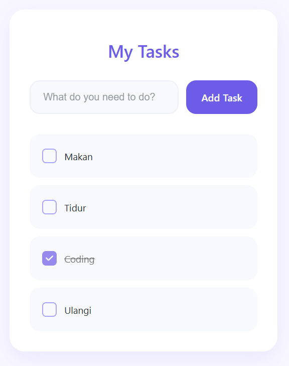

# Modern Todo List App

A sleek and modern Todo List application built with React and Vite, featuring a clean and intuitive user interface with dark mode support.



## Features

- ✨ Modern and clean UI design
- 🌓 Dark mode with persistent preference
- ✅ Add, complete, and delete tasks
- 💫 Smooth animations and transitions
- 🎨 Beautiful purple color scheme
- 🔄 Local storage persistence
- 📱 Responsive design
- ⚡ Lightning-fast performance with Vite

## Tech Stack

- React
- Vite
- CSS3 with modern features
- React Hooks (useState, useEffect)
- Local Storage for data persistence
- CSS Variables for theming
- Docker for containerization

## Getting Started

### Prerequisites

For local development:
- Node.js

For Docker deployment:
- Docker

### Installation

1. Clone the repository:
```bash
git clone [your-repo-url]
cd todolist-vite-react
```

2. Install dependencies:
```bash
npm install
```

3. Start the development server:
```bash
npm run dev
```

The application will be available at `http://localhost:5173`

### Building for Production

To create a production build:

```bash
npm run build
```

The built files will be in the `dist` directory.

### Docker Deployment

You can also run this application using Docker:

1. Build the Docker image:
```bash
docker build -t todo-list-app .
```

2. Run the container:
```bash
docker run -d -p 8080:80 todo-list-app
```

The application will be available at `http://localhost:8080`

## Usage

### Managing Tasks
1. Type your task in the input field
2. Click "Add Task" or press Enter to add the task to your list
3. Click on a task to mark it as complete
4. Hover over a task and click the "×" button to delete it

### Theme Switching
- Click the theme toggle button (☀️/🌙) in the top-right corner to switch between light and dark modes
- Your theme preference is automatically saved and will persist across browser sessions

### Features
- **Dark Mode**: Automatically saves your preference
- **Persistence**: Tasks are saved in your browser's local storage
- **Responsive**: Works on both desktop and mobile devices
- **Keyboard Friendly**: Use Enter to add tasks

## Contributing

Contributions are welcome! Feel free to submit issues and pull requests.

## License

This project is licensed under the MIT License - see the [LICENSE](LICENSE) file for details.
