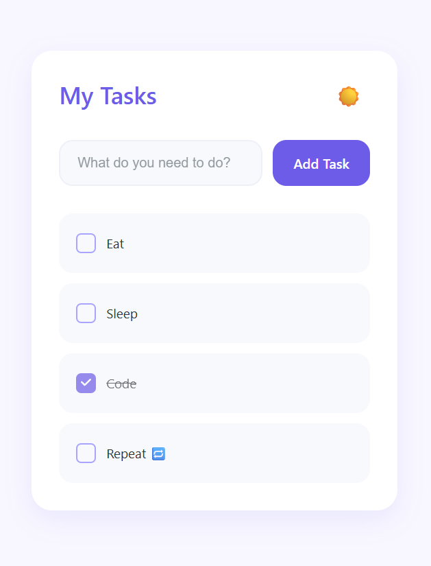

# Modern Todo List App

A sleek and modern Todo List application built with React and Vite, featuring a clean and intuitive user interface.



## Features

- ✨ Modern and clean UI design
- ✅ Add, complete, and delete tasks
- 💫 Smooth animations and transitions
- 🎨 Beautiful purple color scheme
- 📱 Responsive design
- ⚡ Lightning-fast performance with Vite

## Tech Stack

- React
- Vite
- CSS3 with modern features
- React Hooks (useState)

## Getting Started

### Prerequisites

Make sure you have Node.js installed on your system.

### Installation

1. Clone the repository:
```bash
git clone [your-repo-url]
cd todolist-vite-react
```

2. Install dependencies:
```bash
npm install
```

3. Start the development server:
```bash
npm run dev
```

The application will be available at `http://localhost:5173`

### Building for Production

To create a production build:

```bash
npm run build
```

The built files will be in the `dist` directory.

## Usage

1. Type your task in the input field
2. Click "Add Task" or press Enter to add the task to your list
3. Click on a task to mark it as complete
4. Hover over a task and click the "×" button to delete it

## Contributing

Contributions are welcome! Feel free to submit issues and pull requests.

## License

This project is licensed under the MIT License - see the [LICENSE](LICENSE) file for details.
